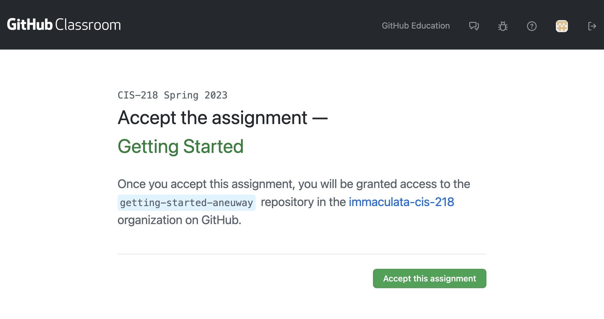
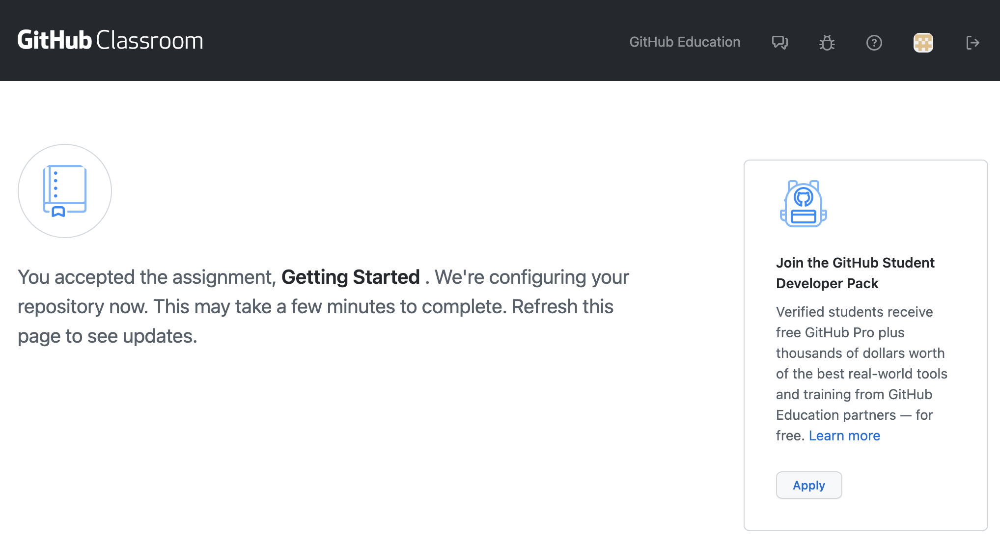
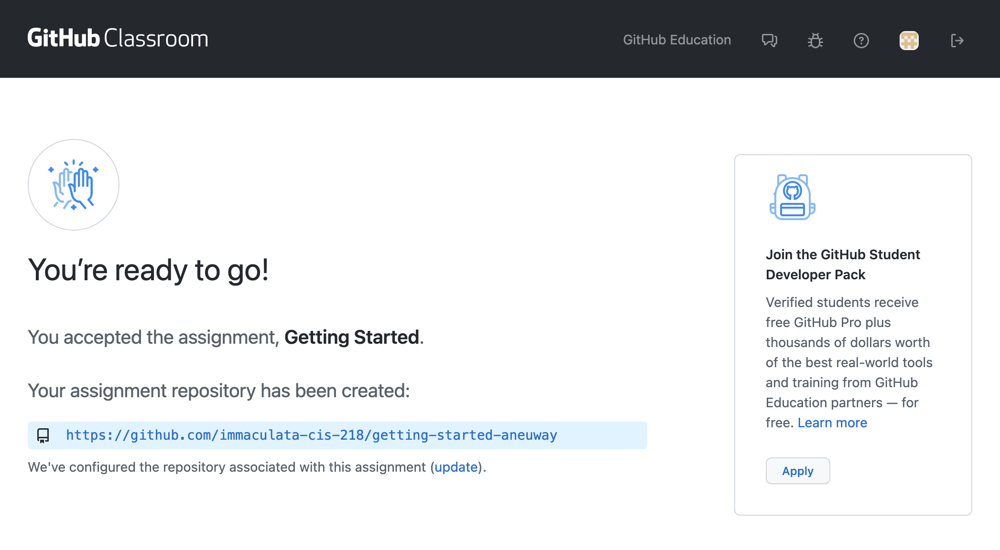

# Accepting Github Classroom Assignments

1. Follow the invitation link provided in each lab assignment in Moodle.
2. Click `Accept this assignment`
   
3. After accepting the assignment, refresh the webpage until the page updates
   
4. When shown the success page, follow the link shown on the screen. 
   
   You may also want to bookmark this URL to easily navigate back to the lab.