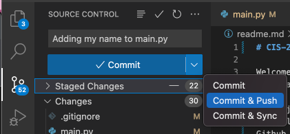
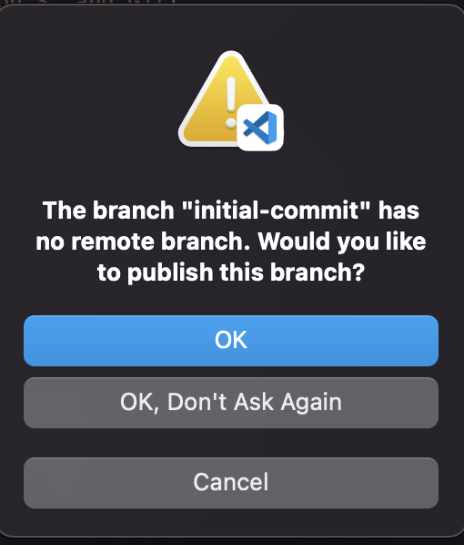

# Saving work in Git

## Commiting and Pushing changes to Github
Commits allow you create a record of changes to the repository. Pushes upload these commits to the internet so that others can see your changes.

To create commits and pushes, use the Source Control menu in VSCode to write a commit message that describes the work you are doing. Be sure to push your changes if you have completed work as it wont be available on the internet if it is not pushed. You will also be prompted the first time to create a remote branch as well.

## Pull Requests (Submitting your Work)
Pull Requests are the final step when you are ready to submit your work.

1. Navigate to your repository in Github (This was created when you accepted the assignment and should also be visible from https://github.com/immaculata-cis-218/)
2. Navigate to the Pull requests screen and select the `New Pull Request` button and follow the prompts to merge your branch into the `main` branch
3. In the lab in Moodle upload the URL of the pull request.

    > Further updates to your branch (commits and pushes) will also update the Pull Request.