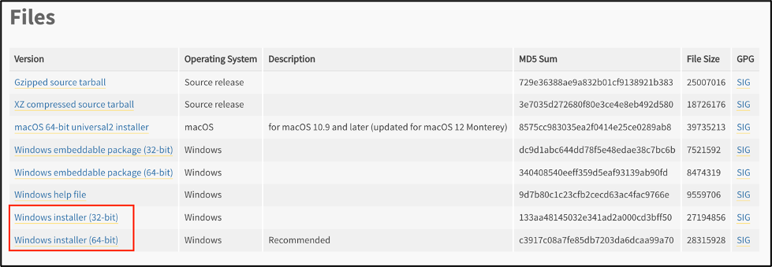
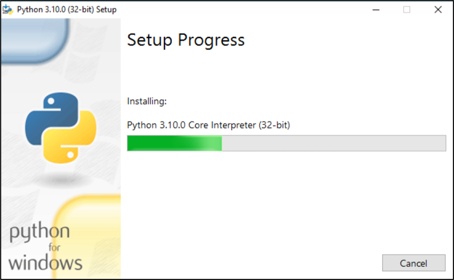

# CIS-218 Software Installation
The following guides provide the steps needed to install Python3 and the Visual Studio Code IDE in:
* [macOS](#macos)
* [Windows](#windows)
* [ChromeOS](#chromeos)
* [Web browser](#web-browser)

## macOS

1. Briefly familiarize yourself with the Terminal program.
   The Terminal program can be opened from _Finder > Applications > Utilities > Terminal_.
   You may also want to keep the Terminal app in your dock for convenience by right-clicking
   on the app and selecting _Options > Keep in Dock_.
   
   

2. Next, we will install Brew. Brew is a package manager that can be used to install programs 
   easily onto your computer using the command line. 
   Using the instructions from https://brew.sh/ paste the following into your terminal window and hit enter:

   ```shell
   /bin/bash -c "$(curl -fsSL https://raw.githubusercontent.com/Homebrew/install/HEAD/install.sh)"
   ```

   You may need to enter your computer password and press the `Enter` (Return) key if prompted:
   

3. Type the following in your Terminal window to install Python3:
   ```shell
   brew install python3
   ```

4. Type the following in your Terminal window to install Git:
   ```shell
   brew install git
   ```

5. Type the following in your Terminal window to install Visual Studio Code (VSCode):
   ```shell
   brew install --cask visual-studio-code
   ```

6. Open VSCode by navigating to _Finder > Applications > Visual Studio Code_.
   You may also want to keep the VSCode app in your dock for convenience by right-clicking
   on the app and selecting _Options > Keep in Dock_.

   
7. Install the [VSCode extension for Python](https://marketplace.visualstudio.com/items?itemName=ms-python.python)
   This will enable VSCode to provide type and style hints as you type python code.

## Windows
1.	Navigate to the Python Releases for Windows page: https://www.python.org/downloads/windows/ 
2.	Select the latest Python 3 Release:

3.	On the next page scroll to the bottom and select the appropriate Windows installer from the Files section based on your operating system. You will need to select the appropriate bit version to use.

      > Use the following Windows support article to determine what version to use if you are unsure: https://support.microsoft.com/en-us/windows/which-version-of-windows-operating-system-am-i-running-628bec99-476a-2c13-5296-9dd081cdd808 
4.	Open the Installer EXE file

5.	Check the “Add Python 3.xx to PATH” option and select Install Now in the installation wizard


6.	On the Success page, click on the “Disable path length limit” option: 

7.	Close the installer
8.	Open the command prompt by pressing the WINDOWS + R keys and then type “cmd” into the textbox and hit enter.

9. in the open command prompt, verify that Python has installed by typing the following into your terminal window:
   ```shell
   py --version
   ```
   
10. [Install Git](https://git-scm.com/download/win) using the appropriate installer for your computer.
11. Follow the installation instructions for installing the appropriate version of [Visual Studio Code on Windows](https://code.visualstudio.com/docs/setup/windows).
12. Install the [VSCode extension for Python](https://marketplace.visualstudio.com/items?itemName=ms-python.python)
    This will enable VSCode to provide type and style hints as you type python code.

## ChromeOS
Follow the guide provided in the following blog post for specifics on installing VSCode on ChromeOS:
[Learning with VS Code on Chromebooks](https://code.visualstudio.com/blogs/2020/12/03/chromebook-get-started)

You will need to:
1. [Enable Linux](https://code.visualstudio.com/blogs/2020/12/03/chromebook-get-started#_enable-linux-on-your-chromebook) on your Chromebook
2. Open the `Terminal` application on your Chromebook and install `gnome-keyring`:
   ```
   sudo apt-get update
   sudo apt-get install -y gnome-keyring
   ```
3. [Download VSCode for Linux](https://code.visualstudio.com/download) using the Debian (.deb) build appropriate for your system. You can run the following command to determine if your Chromebook is AMD64 (64 Bit) or ARM64:
   ```
   dpkg --print-architecture
   ```
4. Open the installer from your Downloads folder.
5. Open the `VSCode` application on your Chromebook

   > You may be prompted to save a password for the keyring when you load the program.
6. Install the [VSCode extension for Python](https://marketplace.visualstudio.com/items?itemName=ms-python.python)
    This will enable VSCode to provide type and style hints as you type python code.

## Web Browser
Visual Studio Code for the web is based on a relatively new concept of running Python 3.11+ in Web Assembly (WASM) which allows for code to be run executed in the web browser. Because of this, you'll need to use experimental features of Visual Studio Code for the web if you want to execute your code in this manner. There may be a few labs where the browser version will not have all of the functionality needed to complete your lab in its entirety.

1. To write Python code on Visual Studio for the web using Google Chrome or Microsoft Edge, use the "insider" version from https://insiders.vscode.dev/?vscode-coi=

2. Follow the instructions provided by the following doc to install the neccessary extensions: https://code.visualstudio.com/docs/python/python-web

3. Additionaly you will need to install the extension from within the web UI called "Experimental - Python for the Web" by Microsoft to run python code in the browser.