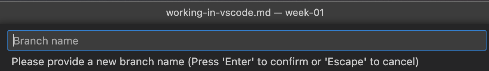

# Working in Visual Studio Code

## Cloning a Repository
To begin working on any project, you'll want to connect to Github to retreive the list of repositories for your account and downlaod the source ocde of the repository.

1. On the file explorer, click the `Clone Repository` button.
2. This will show the VSCode Command Pallete. You can also show this from the following keyboard shortcuts:
    * macOS: `Command` + `Shift` + `P`
    * Windows: `Ctrl` + `Shift` + `P`

3. Select the option to Clone from Guthub
4. Follow the onscreen prompts to login and authorize VSCode to talk to Github.
5. Select the repository that is associated with your account
    > Note: You should have accepted the assignment before you will see the associated repository for your account show in the dropdown list in the Command Pallete.

git 

6. VSCode will prompt you to save your files in a particular place on your computer. It is recommended that you create a specific folder to store your files for this as there will be a new folder created for each lab)
7. Click the `Select as Repository Location` to download the repository.
8. Select `Open` to open the cloned repository. You any also want to trust the entire parent folder to prevent futher prompts in future labs.

## Branching
You should create a new git branch before starting any real work. This allows you to commit your work to this branch and then later when your work is complete, open a pull request. Pull requests show your changes and update the original code (in the `main` branch)

1. Select the branch selector in the bottom left of VSCode

2. Select `Create New Branch`

3. Name your branch something descriptive, and press `enter`.

4. The branch name will be shown in the bottom left of VSCode once completed.

## Running and Debugging your code

While the python file is open in VSCode, click on the run button in the top right. This will run the code and display the output in the terminal below.

You may also want to create breakpoints, and run the file in debug mode. This allows you to see the values of variables and pause the code mid-execution to review what is going on.